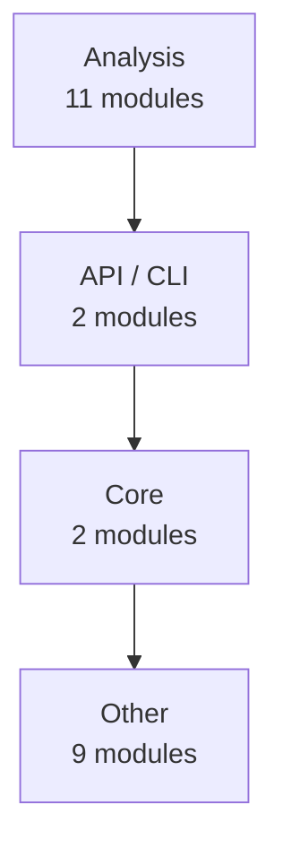
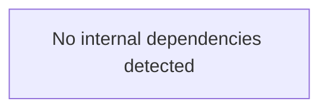

# todocs — Architecture

> 24 modules | 165 functions | 20 classes

## How It Works

`todocs` analyzes source code via a multi-stage pipeline:

```
Source files  ──►  code2llm (tree-sitter + AST)  ──►  AnalysisResult
                                                          │
              ┌───────────────────────────────────────────┘
              ▼
    ┌─────────────────────┐
    │   12 Generators     │
    │  ─────────────────  │
    │  README.md          │
    │  docs/api/          │
    │  docs/modules/      │
    │  docs/architecture   │
    │  docs/coverage      │
    │  examples/          │
    │  mkdocs.yml         │
    │  CONTRIBUTING.md    │
    └─────────────────────┘
```

**Analysis algorithms:**

1. **AST parsing** — language-specific parsers (tree-sitter) extract syntax trees
2. **Cyclomatic complexity** — counts independent code paths per function
3. **Fan-in / fan-out** — measures module coupling (how many modules import/are imported by each)
4. **Docstring extraction** — parses Google/NumPy/Sphinx-style docstrings into structured data
5. **Pattern detection** — identifies design patterns (Factory, Singleton, Observer, etc.)
6. **Dependency scanning** — reads pyproject.toml / requirements.txt / setup.py

## Architecture Layers



### Analysis

- `analyzers`
- `analyzers.code_metrics`
- `analyzers.dependencies`
- `analyzers.import_graph`
- `analyzers.maturity`
- `analyzers.structure`
- `extractors.changelog_parser`
- `extractors.docker_parser`
- `extractors.makefile_parser`
- `extractors.readme_parser`
- `extractors.toon_parser`

### API / CLI

- `analyzers.api_surface`
- `cli`

### Core

- `core`
- `utils`

### Other

- `examples.advanced_usage`
- `examples.quickstart`
- `extractors`
- `extractors.metadata`
- `generators`
- `generators.article`
- `generators.article_sections`
- `generators.comparison`
- `todocs`

## Module Dependency Graph



## Key Classes

```mermaid
classDiagram
    class ToonParser {
        -__init__(self, project_path) None
        +find_toon_files(self) None
        +parse_all(self) None
        +parse_map(self, path) None
        -_parse_map_header(self, text) None
        -_parse_modules_section(self, text) None
        -_parse_details_section(self, text) None
        -_parse_class_line(self, line, current_file) None
        ... +9 more
    }
    class ComparisonGenerator {
        -__init__(self, org_name, org_url) None
        +generate_comparison(self, profiles, output_path) None
        +generate_category_articles(self, profiles, output_dir) None
        +generate_health_report(self, profiles, output_path) None
        -_render_comparison(self, profiles, title) None
        -_size_comparison(self, profiles) None
        -_maturity_leaderboard(self, profiles) None
        -_complexity_comparison(self, profiles) None
        ... +7 more
    }
    class APISurfaceAnalyzer {
        -__init__(self, project_path, filter_func) None
        +analyze(self) None
        -_should_skip(self, path) None
        -_detect_entry_points(self) None
        -_detect_cli_commands(self) None
        -_decorator_name(self, dec_node) None
        -_scan_public_symbols(self) None
        -_collect_target_files(self) None
        ... +5 more
    }
    class StructureAnalyzer {
        -__init__(self, project_path, filter_func) None
        -_should_skip(self, path) None
        -_iter_files(self) None
        +analyze(self) None
        +detect_tech_stack(self) None
        -_detect_languages(self) None
        -_detect_build_tools(self) None
        -_detect_test_frameworks(self) None
        ... +4 more
    }
    class CodeMetricsAnalyzer {
        -__init__(self, project_path, filter_func) None
        -_should_skip(self, path) None
        -_is_test(self, path) None
        -_scan(self) None
        -_count_lines(self, path) None
        +analyze(self) None
        -_ast_complexity(self, tree) None
        -_parse_module_ast(self, code) None
        ... +2 more
    }
    class MakefileParser {
        -__init__(self, project_path) None
        +parse(self) None
        -_parse_makefile(self, path) None
        -_collect_phony_targets(self, text) None
        -_parse_target_line(self, line, lines) None
        -_extract_help_text(self, line, lines) None
        -_collect_commands(self, lines, index) None
        -_parse_taskfile(self, path) None
        ... +1 more
    }
    class ReadmeParser {
        -__init__(self, project_path) None
        +parse(self) None
        -_find_readme(self) None
        -_parse_sections(self, text) None
        -_extract_description(self, text) None
        -_extract_preamble(self, lines) None
        -_extract_post_h1(self, lines) None
        -_extract_heading_sections(self, text) None
        ... +1 more
    }
    class MetadataExtractor {
        -__init__(self, project_path) None
        +extract(self) None
        -_merge(self, target, source) None
        -_from_pyproject(self) None
        -_from_setup_cfg(self) None
        -_from_setup_py(self) None
        -_extract_setup_kwargs(self, call_node) None
        -_from_package_json(self) None
        ... +1 more
    }
    class ImportGraphAnalyzer {
        -__init__(self, project_path, filter_func) None
        -_should_skip(self, path) None
        -_iter_py_files(self) None
        -_module_name(self, path) None
        +build_graph(self) None
        -_detect_internal_packages(self) None
        -_detect_cycles(self, edges) None
        +get_hub_modules(self, top_n) None
    }
    class DockerParser {
        -__init__(self, project_path) None
        +parse(self) None
        -_find_dockerfiles(self) None
        -_find_compose_files(self) None
        -_parse_dockerfile(self, path) None
        -_parse_compose(self, path) None
    }
    class ChangelogParser {
        -__init__(self, project_path) None
        +parse(self, max_entries) None
        -_find_changelog(self) None
        -_parse_entries(self, text, max_entries) None
        -_summarize_entry(self, content, max_items) None
    }
    class ArticleGenerator {
        -__init__(self, org_name, org_url) None
        +generate(self, profile, output_path) None
        +generate_index(self, profiles, output_path) None
        -_render_article(self, p) None
        -_render_index(self, profiles) None
    }
    class GitignoreParser {
        -__init__(self, root_path, max_depth) None
        -_load_gitignore(self) None
        -_parse_patterns(self, content) None
        -_match_pattern(self, pattern, path) None
        +is_ignored(self, relative_path, is_dir) None
    }
    class DependencyAnalyzer {
        -__init__(self, project_path) None
        -_load_pyproject(self) None
        -_parse_dep_name(self, dep) None
        +get_runtime_deps(self) None
        +get_dev_deps(self) None
    }
    class MaturityScorer {
        -__init__(self, project_path, profile) None
        +score(self) None
    }
```



## Public Entry Points

- `cli.main` — todocs — Static-analysis documentation generator for project portfolios.
- `cli.generate` — Scan projects and generate WordPress markdown articles.
- `cli.inspect` — Inspect a single project and show its profile.
- `cli.compare` — Generate cross-project comparison report.
- `cli.health` — Generate organization health report.
- `cli.readme` — Generate a single README.md with project list and 5-line descriptions.

## Metrics Summary

| Metric | Value |
|--------|-------|
| Modules | 24 |
| Functions | 165 |
| Classes | 20 |
| CFG Nodes | 1295 |
| Patterns | 0 |
| Avg Complexity | 5.5 |
| Analysis Time | 1.3s |
