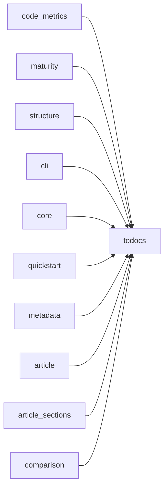

# todocs — Dependency Graph

> 24 modules, 10 dependency edges

## Module Dependencies

## Coupling Matrix

| | analyzers | api_surface | code_metrics | dependencies | import_graph | maturity | structure | cli | core | advanced_usage | quickstart | extractors | changelog_parser | docker_parser | makefile_parser | metadata | readme_parser | toon_parser | generators | article | article_sections | comparison | todocs | utils |
| --- | --- | --- | --- | --- | --- | --- | --- | --- | --- | --- | --- | --- | --- | --- | --- | --- | --- | --- | --- | --- | --- | --- | --- | --- |
| **analyzers** | · |  |  |  |  |  |  |  |  |  |  |  |  |  |  |  |  |  |  |  |  |  |  |  |
| **api_surface** |  | · |  |  |  |  |  |  |  |  |  |  |  |  |  |  |  |  |  |  |  |  |  |  |
| **code_metrics** |  |  | · |  |  |  |  |  |  |  |  |  |  |  |  |  |  |  |  |  |  |  | → |  |
| **dependencies** |  |  |  | · |  |  |  |  |  |  |  |  |  |  |  |  |  |  |  |  |  |  |  |  |
| **import_graph** |  |  |  |  | · |  |  |  |  |  |  |  |  |  |  |  |  |  |  |  |  |  |  |  |
| **maturity** |  |  |  |  |  | · |  |  |  |  |  |  |  |  |  |  |  |  |  |  |  |  | → |  |
| **structure** |  |  |  |  |  |  | · |  |  |  |  |  |  |  |  |  |  |  |  |  |  |  | → |  |
| **cli** |  |  |  |  |  |  |  | · |  |  |  |  |  |  |  |  |  |  |  |  |  |  | → |  |
| **core** |  |  |  |  |  |  |  |  | · |  |  |  |  |  |  |  |  |  |  |  |  |  | → |  |
| **advanced_usage** |  |  |  |  |  |  |  |  |  | · |  |  |  |  |  |  |  |  |  |  |  |  |  |  |
| **quickstart** |  |  |  |  |  |  |  |  |  |  | · |  |  |  |  |  |  |  |  |  |  |  | → |  |
| **extractors** |  |  |  |  |  |  |  |  |  |  |  | · |  |  |  |  |  |  |  |  |  |  |  |  |
| **changelog_parser** |  |  |  |  |  |  |  |  |  |  |  |  | · |  |  |  |  |  |  |  |  |  |  |  |
| **docker_parser** |  |  |  |  |  |  |  |  |  |  |  |  |  | · |  |  |  |  |  |  |  |  |  |  |
| **makefile_parser** |  |  |  |  |  |  |  |  |  |  |  |  |  |  | · |  |  |  |  |  |  |  |  |  |
| **metadata** |  |  |  |  |  |  |  |  |  |  |  |  |  |  |  | · |  |  |  |  |  |  | → |  |
| **readme_parser** |  |  |  |  |  |  |  |  |  |  |  |  |  |  |  |  | · |  |  |  |  |  |  |  |
| **toon_parser** |  |  |  |  |  |  |  |  |  |  |  |  |  |  |  |  |  | · |  |  |  |  |  |  |
| **generators** |  |  |  |  |  |  |  |  |  |  |  |  |  |  |  |  |  |  | · |  |  |  |  |  |
| **article** |  |  |  |  |  |  |  |  |  |  |  |  |  |  |  |  |  |  |  | · |  |  | → |  |
| **article_sections** |  |  |  |  |  |  |  |  |  |  |  |  |  |  |  |  |  |  |  |  | · |  | → |  |
| **comparison** |  |  |  |  |  |  |  |  |  |  |  |  |  |  |  |  |  |  |  |  |  | · | → |  |
| **todocs** |  |  |  |  |  |  |  |  |  |  |  |  |  |  |  |  |  |  |  |  |  |  | · |  |
| **utils** |  |  |  |  |  |  |  |  |  |  |  |  |  |  |  |  |  |  |  |  |  |  |  | · |

## Fan-in / Fan-out

| Module | Fan-in | Fan-out |
|--------|--------|---------|
| `analyzers` | 0 | 0 |
| `analyzers.api_surface` | 0 | 0 |
| `analyzers.code_metrics` | 0 | 1 |
| `analyzers.dependencies` | 0 | 0 |
| `analyzers.import_graph` | 0 | 0 |
| `analyzers.maturity` | 0 | 1 |
| `analyzers.structure` | 0 | 1 |
| `cli` | 0 | 1 |
| `core` | 0 | 1 |
| `examples.advanced_usage` | 0 | 0 |
| `examples.quickstart` | 0 | 1 |
| `extractors` | 0 | 0 |
| `extractors.changelog_parser` | 0 | 0 |
| `extractors.docker_parser` | 0 | 0 |
| `extractors.makefile_parser` | 0 | 0 |
| `extractors.metadata` | 0 | 1 |
| `extractors.readme_parser` | 0 | 0 |
| `extractors.toon_parser` | 0 | 0 |
| `generators` | 0 | 0 |
| `generators.article` | 0 | 1 |
| `generators.article_sections` | 0 | 1 |
| `generators.comparison` | 0 | 1 |
| `todocs` | 10 | 0 |
| `utils` | 0 | 0 |
