# System Architecture Analysis

## Overview

- **Project**: /home/tom/github/wronai/todocs
- **Analysis Mode**: static
- **Total Functions**: 123
- **Total Classes**: 19
- **Modules**: 23
- **Entry Points**: 118

## Architecture by Module

### todocs.generators.article
- **Functions**: 19
- **Classes**: 1
- **File**: `article.py`

### todocs.generators.comparison
- **Functions**: 13
- **Classes**: 1
- **File**: `comparison.py`

### todocs.analyzers.api_surface
- **Functions**: 9
- **Classes**: 1
- **File**: `api_surface.py`

### todocs.extractors.metadata
- **Functions**: 9
- **Classes**: 1
- **File**: `metadata.py`

### todocs.extractors.toon_parser
- **Functions**: 8
- **Classes**: 1
- **File**: `toon_parser.py`

### todocs.analyzers.import_graph
- **Functions**: 8
- **Classes**: 1
- **File**: `import_graph.py`

### todocs.analyzers.code_metrics
- **Functions**: 8
- **Classes**: 1
- **File**: `code_metrics.py`

### todocs.core
- **Functions**: 7
- **Classes**: 5
- **File**: `core.py`

### todocs.extractors.docker_parser
- **Functions**: 6
- **Classes**: 1
- **File**: `docker_parser.py`

### todocs.analyzers.structure
- **Functions**: 6
- **Classes**: 1
- **File**: `structure.py`

### todocs.cli
- **Functions**: 5
- **File**: `cli.py`

### todocs.extractors.makefile_parser
- **Functions**: 5
- **Classes**: 1
- **File**: `makefile_parser.py`

### todocs.extractors.readme_parser
- **Functions**: 5
- **Classes**: 1
- **File**: `readme_parser.py`

### todocs.extractors.changelog_parser
- **Functions**: 5
- **Classes**: 1
- **File**: `changelog_parser.py`

### todocs.analyzers.dependencies
- **Functions**: 5
- **Classes**: 1
- **File**: `dependencies.py`

### todocs.analyzers.maturity
- **Functions**: 2
- **Classes**: 1
- **File**: `maturity.py`

### examples.scan_org
- **Functions**: 1
- **File**: `scan_org.py`

### examples.scan_single
- **Functions**: 1
- **File**: `scan_single.py`

### examples.custom_analysis
- **Functions**: 1
- **File**: `custom_analysis.py`

## Key Entry Points

Main execution flows into the system:

### examples.custom_analysis.main
- **Calls**: None.resolve, print, print, print, ImportGraphAnalyzer, ig.build_graph, print, print

### todocs.cli.generate
> Scan projects and generate WordPress markdown articles.

ROOT_DIR is the directory containing project subdirectories.
- **Calls**: main.command, click.argument, click.option, click.option, click.option, click.option, click.option, click.option

### examples.scan_single.main
- **Calls**: None.resolve, print, todocs.core.scan_project, len, print, sys.exit, project_path.is_dir, print

### todocs.extractors.toon_parser.ToonParser.parse_analysis
> Parse analysis.toon — health, coupling, layers.
- **Calls**: self._read, re.search, re.search, re.search, re.search, text.splitlines, text.splitlines, text.splitlines

### todocs.extractors.toon_parser.ToonParser.parse_map
> Parse project.toon / map.toon — module listing with metadata.
- **Calls**: self._read, re.match, text.splitlines, text.splitlines, header_m.group, int, int, None.startswith

### todocs.analyzers.import_graph.ImportGraphAnalyzer.build_graph
> Build the import dependency graph.

Returns:
    {
        "nodes": [{"name": "module.name", "lines": N, "is_test": bool}],
        "edges": [{"from":
- **Calls**: self._detect_internal_packages, defaultdict, defaultdict, self._iter_py_files, defaultdict, defaultdict, edges.items, self._detect_cycles

### todocs.extractors.readme_parser.ReadmeParser._parse_sections
> Split markdown by headings into sections.
- **Calls**: text.split, None.strip, re.compile, list, enumerate, re.match, re.sub, re.sub

### todocs.generators.comparison.ComparisonGenerator._render_health_report
- **Calls**: sections.append, sections.append, len, sum, sum, sum, sections.append, sections.append

### todocs.analyzers.structure.StructureAnalyzer.detect_tech_stack
> Detect technology stack from files and markers.
- **Calls**: Counter, self._iter_files, _BUILD_TOOL_FILES.items, _TEST_FRAMEWORK_FILES.items, _CI_FILES.items, _DOCKER_FILES.items, self._read_deps_text, _FRAMEWORK_MARKERS.items

### todocs.analyzers.api_surface.APISurfaceAnalyzer._scan_public_symbols
> Scan __init__.py and main modules for public classes and functions.
- **Calls**: self.root.rglob, self.root.rglob, set, set, self._should_skip, pyf.relative_to, str, self._extract_all

### todocs.analyzers.dependencies.DependencyAnalyzer.get_dev_deps
> Get development dependencies.
- **Calls**: self._load_pyproject, None.get, None.get, None.get, None.get, pkg_json.exists, set, opt.get

### todocs.generators.article.ArticleGenerator._render_index
- **Calls**: sections.append, sections.append, sections.append, sum, sum, sections.append, sorted, sections.append

### todocs.extractors.makefile_parser.MakefileParser._parse_makefile
> Parse GNU Makefile targets.
- **Calls**: set, text.splitlines, text.splitlines, enumerate, path.read_text, re.match, re.match, phony_targets.update

### todocs.analyzers.code_metrics.CodeMetricsAnalyzer.analyze
> Return CodeStats dataclass.
- **Calls**: self._scan, len, len, sum, sum, hotspots.sort, CodeStats, self._is_test

### todocs.generators.article.ArticleGenerator._render_article
- **Calls**: sections.append, sections.append, sections.append, sections.append, sections.append, sections.append, sections.append, sections.append

### todocs.extractors.docker_parser.DockerParser._parse_compose
> Extract services, ports, volumes from docker-compose.yml.
- **Calls**: data.get, raw_services.items, list, yaml.safe_load, isinstance, svc.get, bool, svc.get

### todocs.generators.comparison.ComparisonGenerator._render_category
- **Calls**: sections.append, sections.append, sections.append, lines.append, lines.append, sorted, sections.append, sum

### todocs.generators.article.ArticleGenerator._api_surface_section
- **Calls**: api.get, api.get, api.get, api.get, api.get, None.join, lines.append, lines.append

### todocs.analyzers.maturity.MaturityScorer.score
- **Calls**: None.is_dir, None.exists, None.exists, None.exists, None.exists, max, set, len

### todocs.analyzers.dependencies.DependencyAnalyzer.get_runtime_deps
> Get runtime dependencies.
- **Calls**: self._load_pyproject, None.get, deps.extend, None.get, req_file.exists, pkg_json.exists, set, d.lower

### todocs.extractors.metadata.MetadataExtractor._from_pyproject
- **Calls**: data.get, None.get, combined.get, combined.get, combined.get, self._extract_license, combined.get, combined.get

### examples.scan_org.main
- **Calls**: None.resolve, Path, print, todocs.core.scan_organization, print, sorted, print, sorted

### todocs.analyzers.code_metrics.CodeMetricsAnalyzer.get_key_modules
> Return the top N most significant Python modules by size and complexity.
- **Calls**: self._scan, modules.sort, self._is_test, str, modules.append, pyf.read_text, ast.parse, ast.walk

### todocs.extractors.toon_parser.ToonParser.parse_flow
> Parse flow.toon — pipeline and data-flow analysis.
- **Calls**: self._read, re.match, text.splitlines, int, int, re.match, pipelines.append, hm.group

### todocs.generators.article.ArticleGenerator._architecture_section
- **Calls**: lines.append, lines.append, lines.append, lines.append, None.join, len, len, None.strip

### todocs.generators.article.ArticleGenerator._docker_section
- **Calls**: docker.get, docker.get, docker.get, None.join, lines.append, lines.append, lines.append, lines.append

### todocs.extractors.docker_parser.DockerParser._parse_dockerfile
> Extract FROM images, EXPOSE ports, ENTRYPOINT from Dockerfile.
- **Calls**: text.splitlines, path.read_text, line.strip, re.match, re.match, re.match, re.match, line.startswith

### todocs.generators.comparison.ComparisonGenerator._tech_stack_overview
- **Calls**: Counter, Counter, Counter, lines.append, lines.append, lines.append, lang_counter.most_common, None.join

### todocs.generators.article.ArticleGenerator._metrics_section
- **Calls**: lines.append, lines.append, lines.append, lines.append, lines.append, lines.append, lines.append, lines.append

### todocs.generators.article.ArticleGenerator._usage_section
- **Calls**: p.readme_sections.get, p.readme_sections.get, None.join, parts.append, parts.append, parts.append, parts.append, parts.append

## Process Flows

Key execution flows identified:

### Flow 1: main
```
main [examples.custom_analysis]
```

### Flow 2: generate
```
generate [todocs.cli]
```

### Flow 3: parse_analysis
```
parse_analysis [todocs.extractors.toon_parser.ToonParser]
```

### Flow 4: parse_map
```
parse_map [todocs.extractors.toon_parser.ToonParser]
```

### Flow 5: build_graph
```
build_graph [todocs.analyzers.import_graph.ImportGraphAnalyzer]
```

### Flow 6: _parse_sections
```
_parse_sections [todocs.extractors.readme_parser.ReadmeParser]
```

### Flow 7: _render_health_report
```
_render_health_report [todocs.generators.comparison.ComparisonGenerator]
```

### Flow 8: detect_tech_stack
```
detect_tech_stack [todocs.analyzers.structure.StructureAnalyzer]
```

### Flow 9: _scan_public_symbols
```
_scan_public_symbols [todocs.analyzers.api_surface.APISurfaceAnalyzer]
```

### Flow 10: get_dev_deps
```
get_dev_deps [todocs.analyzers.dependencies.DependencyAnalyzer]
```

## Key Classes

### todocs.generators.article.ArticleGenerator
> Generate markdown articles for WordPress from analyzed project profiles.
- **Methods**: 19
- **Key Methods**: todocs.generators.article.ArticleGenerator.__init__, todocs.generators.article.ArticleGenerator.generate, todocs.generators.article.ArticleGenerator.generate_index, todocs.generators.article.ArticleGenerator._render_article, todocs.generators.article.ArticleGenerator._frontmatter, todocs.generators.article.ArticleGenerator._header, todocs.generators.article.ArticleGenerator._overview, todocs.generators.article.ArticleGenerator._tech_stack_section, todocs.generators.article.ArticleGenerator._architecture_section, todocs.generators.article.ArticleGenerator._metrics_section

### todocs.generators.comparison.ComparisonGenerator
> Generate comparative analysis articles across projects.
- **Methods**: 13
- **Key Methods**: todocs.generators.comparison.ComparisonGenerator.__init__, todocs.generators.comparison.ComparisonGenerator.generate_comparison, todocs.generators.comparison.ComparisonGenerator.generate_category_articles, todocs.generators.comparison.ComparisonGenerator.generate_health_report, todocs.generators.comparison.ComparisonGenerator._render_comparison, todocs.generators.comparison.ComparisonGenerator._size_comparison, todocs.generators.comparison.ComparisonGenerator._maturity_leaderboard, todocs.generators.comparison.ComparisonGenerator._complexity_comparison, todocs.generators.comparison.ComparisonGenerator._tech_stack_overview, todocs.generators.comparison.ComparisonGenerator._dependency_overlap

### todocs.analyzers.api_surface.APISurfaceAnalyzer
> Detect public API surface of a project.
- **Methods**: 9
- **Key Methods**: todocs.analyzers.api_surface.APISurfaceAnalyzer.__init__, todocs.analyzers.api_surface.APISurfaceAnalyzer.analyze, todocs.analyzers.api_surface.APISurfaceAnalyzer._should_skip, todocs.analyzers.api_surface.APISurfaceAnalyzer._detect_entry_points, todocs.analyzers.api_surface.APISurfaceAnalyzer._detect_cli_commands, todocs.analyzers.api_surface.APISurfaceAnalyzer._decorator_name, todocs.analyzers.api_surface.APISurfaceAnalyzer._scan_public_symbols, todocs.analyzers.api_surface.APISurfaceAnalyzer._extract_all, todocs.analyzers.api_surface.APISurfaceAnalyzer._detect_rest_endpoints

### todocs.extractors.metadata.MetadataExtractor
> Extract structured metadata from project config files.
- **Methods**: 9
- **Key Methods**: todocs.extractors.metadata.MetadataExtractor.__init__, todocs.extractors.metadata.MetadataExtractor.extract, todocs.extractors.metadata.MetadataExtractor._merge, todocs.extractors.metadata.MetadataExtractor._from_pyproject, todocs.extractors.metadata.MetadataExtractor._from_setup_cfg, todocs.extractors.metadata.MetadataExtractor._from_setup_py, todocs.extractors.metadata.MetadataExtractor._extract_setup_kwargs, todocs.extractors.metadata.MetadataExtractor._from_package_json, todocs.extractors.metadata.MetadataExtractor._extract_license

### todocs.extractors.toon_parser.ToonParser
> Parse .toon files into structured data.
- **Methods**: 8
- **Key Methods**: todocs.extractors.toon_parser.ToonParser.__init__, todocs.extractors.toon_parser.ToonParser.find_toon_files, todocs.extractors.toon_parser.ToonParser.parse_all, todocs.extractors.toon_parser.ToonParser.parse_map, todocs.extractors.toon_parser.ToonParser.parse_analysis, todocs.extractors.toon_parser.ToonParser.parse_flow, todocs.extractors.toon_parser.ToonParser.parse_functions, todocs.extractors.toon_parser.ToonParser._read

### todocs.analyzers.import_graph.ImportGraphAnalyzer
> Analyze import relationships between project modules.
- **Methods**: 8
- **Key Methods**: todocs.analyzers.import_graph.ImportGraphAnalyzer.__init__, todocs.analyzers.import_graph.ImportGraphAnalyzer._should_skip, todocs.analyzers.import_graph.ImportGraphAnalyzer._iter_py_files, todocs.analyzers.import_graph.ImportGraphAnalyzer._module_name, todocs.analyzers.import_graph.ImportGraphAnalyzer.build_graph, todocs.analyzers.import_graph.ImportGraphAnalyzer._detect_internal_packages, todocs.analyzers.import_graph.ImportGraphAnalyzer._detect_cycles, todocs.analyzers.import_graph.ImportGraphAnalyzer.get_hub_modules

### todocs.analyzers.code_metrics.CodeMetricsAnalyzer
> Analyze code metrics: lines, complexity, maintainability.
- **Methods**: 8
- **Key Methods**: todocs.analyzers.code_metrics.CodeMetricsAnalyzer.__init__, todocs.analyzers.code_metrics.CodeMetricsAnalyzer._should_skip, todocs.analyzers.code_metrics.CodeMetricsAnalyzer._is_test, todocs.analyzers.code_metrics.CodeMetricsAnalyzer._scan, todocs.analyzers.code_metrics.CodeMetricsAnalyzer._count_lines, todocs.analyzers.code_metrics.CodeMetricsAnalyzer.analyze, todocs.analyzers.code_metrics.CodeMetricsAnalyzer._ast_complexity, todocs.analyzers.code_metrics.CodeMetricsAnalyzer.get_key_modules

### todocs.extractors.docker_parser.DockerParser
> Extract Docker infrastructure from Dockerfile and docker-compose.yml.
- **Methods**: 6
- **Key Methods**: todocs.extractors.docker_parser.DockerParser.__init__, todocs.extractors.docker_parser.DockerParser.parse, todocs.extractors.docker_parser.DockerParser._find_dockerfiles, todocs.extractors.docker_parser.DockerParser._find_compose_files, todocs.extractors.docker_parser.DockerParser._parse_dockerfile, todocs.extractors.docker_parser.DockerParser._parse_compose

### todocs.analyzers.structure.StructureAnalyzer
> Analyze project directory structure.
- **Methods**: 6
- **Key Methods**: todocs.analyzers.structure.StructureAnalyzer.__init__, todocs.analyzers.structure.StructureAnalyzer._should_skip, todocs.analyzers.structure.StructureAnalyzer._iter_files, todocs.analyzers.structure.StructureAnalyzer.analyze, todocs.analyzers.structure.StructureAnalyzer.detect_tech_stack, todocs.analyzers.structure.StructureAnalyzer._read_deps_text

### todocs.extractors.makefile_parser.MakefileParser
> Extract targets and structure from Makefile or Taskfile.yml.
- **Methods**: 5
- **Key Methods**: todocs.extractors.makefile_parser.MakefileParser.__init__, todocs.extractors.makefile_parser.MakefileParser.parse, todocs.extractors.makefile_parser.MakefileParser._parse_makefile, todocs.extractors.makefile_parser.MakefileParser._parse_taskfile, todocs.extractors.makefile_parser.MakefileParser.get_target_names

### todocs.extractors.readme_parser.ReadmeParser
> Extract structured sections from a README.md file.
- **Methods**: 5
- **Key Methods**: todocs.extractors.readme_parser.ReadmeParser.__init__, todocs.extractors.readme_parser.ReadmeParser.parse, todocs.extractors.readme_parser.ReadmeParser._find_readme, todocs.extractors.readme_parser.ReadmeParser._parse_sections, todocs.extractors.readme_parser.ReadmeParser.get_first_paragraph

### todocs.extractors.changelog_parser.ChangelogParser
> Extract structured entries from CHANGELOG.md.
- **Methods**: 5
- **Key Methods**: todocs.extractors.changelog_parser.ChangelogParser.__init__, todocs.extractors.changelog_parser.ChangelogParser.parse, todocs.extractors.changelog_parser.ChangelogParser._find_changelog, todocs.extractors.changelog_parser.ChangelogParser._parse_entries, todocs.extractors.changelog_parser.ChangelogParser._summarize_entry

### todocs.analyzers.dependencies.DependencyAnalyzer
> Extract project dependencies without executing anything.
- **Methods**: 5
- **Key Methods**: todocs.analyzers.dependencies.DependencyAnalyzer.__init__, todocs.analyzers.dependencies.DependencyAnalyzer._load_pyproject, todocs.analyzers.dependencies.DependencyAnalyzer._parse_dep_name, todocs.analyzers.dependencies.DependencyAnalyzer.get_runtime_deps, todocs.analyzers.dependencies.DependencyAnalyzer.get_dev_deps

### todocs.analyzers.maturity.MaturityScorer
> Compute a maturity score (0-100) for a project.
- **Methods**: 2
- **Key Methods**: todocs.analyzers.maturity.MaturityScorer.__init__, todocs.analyzers.maturity.MaturityScorer.score

### todocs.core.ProjectProfile
> Complete project profile for article generation.
- **Methods**: 2
- **Key Methods**: todocs.core.ProjectProfile.to_dict, todocs.core.ProjectProfile.to_json

### todocs.core.TechStack
> Detected technology stack.
- **Methods**: 0

### todocs.core.CodeStats
> Aggregated code statistics.
- **Methods**: 0

### todocs.core.ProjectMetadata
> Extracted project metadata.
- **Methods**: 0

### todocs.core.MaturityProfile
> Project maturity assessment.
- **Methods**: 0

## Data Transformation Functions

Key functions that process and transform data:

### todocs.extractors.makefile_parser.MakefileParser.parse
> Parse build file and return targets with descriptions.
- **Output to**: makefile.exists, self._parse_makefile, taskfile.exists, self._parse_taskfile

### todocs.extractors.makefile_parser.MakefileParser._parse_makefile
> Parse GNU Makefile targets.
- **Output to**: set, text.splitlines, text.splitlines, enumerate, path.read_text

### todocs.extractors.makefile_parser.MakefileParser._parse_taskfile
> Parse Taskfile.yml (go-task format).
- **Output to**: data.get, tasks.items, yaml.safe_load, isinstance, isinstance

### todocs.extractors.toon_parser.ToonParser.parse_all
> Parse all discovered .toon files and return unified summary.
- **Output to**: self.find_toon_files, list, self.parse_map, self.parse_analysis, self.parse_flow

### todocs.extractors.toon_parser.ToonParser.parse_map
> Parse project.toon / map.toon — module listing with metadata.
- **Output to**: self._read, re.match, text.splitlines, text.splitlines, header_m.group

### todocs.extractors.toon_parser.ToonParser.parse_analysis
> Parse analysis.toon — health, coupling, layers.
- **Output to**: self._read, re.search, re.search, re.search, re.search

### todocs.extractors.toon_parser.ToonParser.parse_flow
> Parse flow.toon — pipeline and data-flow analysis.
- **Output to**: self._read, re.match, text.splitlines, int, int

### todocs.extractors.toon_parser.ToonParser.parse_functions
> Parse *.functions.toon — exported function signatures.
- **Output to**: self._read, text.splitlines, re.match, fm.group, None.islower

### todocs.extractors.readme_parser.ReadmeParser.parse
> Parse README and return section_name -> content dict.
- **Output to**: self._find_readme, self._parse_sections, readme_path.read_text

### todocs.extractors.readme_parser.ReadmeParser._parse_sections
> Split markdown by headings into sections.
- **Output to**: text.split, None.strip, re.compile, list, enumerate

### todocs.extractors.changelog_parser.ChangelogParser.parse
> Return list of {version, date, content} dicts for recent releases.
- **Output to**: self._find_changelog, self._parse_entries, cl_path.read_text

### todocs.extractors.changelog_parser.ChangelogParser._parse_entries
> Parse Keep-a-Changelog or similar format.
- **Output to**: re.compile, list, enumerate, heading_re.finditer, m.group

### todocs.extractors.docker_parser.DockerParser.parse
> Parse all Docker-related files.
- **Output to**: self._find_dockerfiles, self._find_compose_files, list, list, self._parse_dockerfile

### todocs.extractors.docker_parser.DockerParser._parse_dockerfile
> Extract FROM images, EXPOSE ports, ENTRYPOINT from Dockerfile.
- **Output to**: text.splitlines, path.read_text, line.strip, re.match, re.match

### todocs.extractors.docker_parser.DockerParser._parse_compose
> Extract services, ports, volumes from docker-compose.yml.
- **Output to**: data.get, raw_services.items, list, yaml.safe_load, isinstance

### todocs.analyzers.dependencies.DependencyAnalyzer._parse_dep_name
> Extract package name from a dependency spec like 'foo>=1.0; python_version<3.11'.
- **Output to**: dep.strip, re.match, m.group

## Public API Surface

Functions exposed as public API (no underscore prefix):

- `examples.custom_analysis.main` - 106 calls
- `todocs.cli.generate` - 60 calls
- `examples.scan_single.main` - 57 calls
- `todocs.extractors.toon_parser.ToonParser.parse_analysis` - 51 calls
- `todocs.extractors.toon_parser.ToonParser.parse_map` - 42 calls
- `todocs.analyzers.import_graph.ImportGraphAnalyzer.build_graph` - 42 calls
- `todocs.analyzers.structure.StructureAnalyzer.detect_tech_stack` - 36 calls
- `todocs.analyzers.dependencies.DependencyAnalyzer.get_dev_deps` - 33 calls
- `todocs.core.scan_project` - 32 calls
- `todocs.analyzers.code_metrics.CodeMetricsAnalyzer.analyze` - 31 calls
- `todocs.analyzers.maturity.MaturityScorer.score` - 28 calls
- `todocs.analyzers.dependencies.DependencyAnalyzer.get_runtime_deps` - 27 calls
- `examples.scan_org.main` - 26 calls
- `todocs.analyzers.code_metrics.CodeMetricsAnalyzer.get_key_modules` - 26 calls
- `todocs.extractors.toon_parser.ToonParser.parse_flow` - 23 calls
- `todocs.cli.compare` - 18 calls
- `todocs.cli.inspect` - 17 calls
- `todocs.extractors.docker_parser.DockerParser.parse` - 16 calls
- `todocs.cli.health` - 15 calls
- `todocs.core.generate_articles` - 15 calls
- `todocs.core.scan_organization` - 12 calls
- `todocs.extractors.metadata.MetadataExtractor.extract` - 12 calls
- `todocs.analyzers.structure.StructureAnalyzer.analyze` - 11 calls
- `todocs.analyzers.import_graph.ImportGraphAnalyzer.get_hub_modules` - 11 calls
- `todocs.generators.comparison.ComparisonGenerator.generate_category_articles` - 10 calls
- `todocs.extractors.toon_parser.ToonParser.parse_functions` - 9 calls
- `todocs.extractors.toon_parser.ToonParser.parse_all` - 7 calls
- `todocs.extractors.makefile_parser.MakefileParser.parse` - 4 calls
- `todocs.extractors.toon_parser.ToonParser.find_toon_files` - 4 calls
- `todocs.extractors.readme_parser.ReadmeParser.get_first_paragraph` - 4 calls
- `todocs.analyzers.api_surface.APISurfaceAnalyzer.analyze` - 4 calls
- `todocs.extractors.readme_parser.ReadmeParser.parse` - 3 calls
- `todocs.extractors.changelog_parser.ChangelogParser.parse` - 3 calls
- `todocs.generators.comparison.ComparisonGenerator.generate_comparison` - 3 calls
- `todocs.generators.comparison.ComparisonGenerator.generate_health_report` - 3 calls
- `todocs.cli.main` - 2 calls
- `todocs.extractors.makefile_parser.MakefileParser.get_target_names` - 2 calls
- `todocs.generators.article.ArticleGenerator.generate` - 2 calls
- `todocs.generators.article.ArticleGenerator.generate_index` - 2 calls
- `todocs.core.ProjectProfile.to_dict` - 2 calls

## System Interactions

How components interact:

```mermaid
graph TD
    main --> resolve
    main --> print
    main --> ImportGraphAnalyzer
    generate --> command
    generate --> argument
    generate --> option
    main --> scan_project
    main --> len
    parse_analysis --> _read
    parse_analysis --> search
    parse_map --> _read
    parse_map --> match
    parse_map --> splitlines
    parse_map --> group
    build_graph --> _detect_internal_pac
    build_graph --> defaultdict
    build_graph --> _iter_py_files
    _parse_sections --> split
    _parse_sections --> strip
    _parse_sections --> compile
    _parse_sections --> list
    _parse_sections --> enumerate
    _render_health_repor --> append
    _render_health_repor --> len
    _render_health_repor --> sum
    detect_tech_stack --> Counter
    detect_tech_stack --> _iter_files
    detect_tech_stack --> items
    _scan_public_symbols --> rglob
    _scan_public_symbols --> set
```



## Reverse Engineering Guidelines

1. **Entry Points**: Start analysis from the entry points listed above
2. **Core Logic**: Focus on classes with many methods
3. **Data Flow**: Follow data transformation functions
4. **Process Flows**: Use the flow diagrams for execution paths
5. **API Surface**: Public API functions reveal the interface

## Context for LLM

Maintain the identified architectural patterns and public API surface when suggesting changes.