# System Architecture Analysis

## Overview

- **Project**: /home/tom/github/wronai/todocs
- **Analysis Mode**: static
- **Total Functions**: 66
- **Total Classes**: 13
- **Modules**: 14
- **Entry Points**: 61

## Architecture by Module

### todocs.generators.article
- **Functions**: 16
- **Classes**: 1
- **File**: `article.py`

### todocs.extractors.metadata
- **Functions**: 9
- **Classes**: 1
- **File**: `metadata.py`

### todocs.analyzers.code_metrics
- **Functions**: 8
- **Classes**: 1
- **File**: `code_metrics.py`

### todocs.core
- **Functions**: 7
- **Classes**: 5
- **File**: `core.py`

### todocs.analyzers.structure
- **Functions**: 6
- **Classes**: 1
- **File**: `structure.py`

### todocs.extractors.readme_parser
- **Functions**: 5
- **Classes**: 1
- **File**: `readme_parser.py`

### todocs.extractors.changelog_parser
- **Functions**: 5
- **Classes**: 1
- **File**: `changelog_parser.py`

### todocs.analyzers.dependencies
- **Functions**: 5
- **Classes**: 1
- **File**: `dependencies.py`

### todocs.cli
- **Functions**: 3
- **File**: `cli.py`

### todocs.analyzers.maturity
- **Functions**: 2
- **Classes**: 1
- **File**: `maturity.py`

## Key Entry Points

Main execution flows into the system:

### todocs.cli.generate
> Scan projects and generate WordPress markdown articles.

ROOT_DIR is the directory containing project subdirectories.
- **Calls**: main.command, click.argument, click.option, click.option, click.option, click.option, click.option, click.option

### todocs.extractors.readme_parser.ReadmeParser._parse_sections
> Split markdown by headings into sections.
- **Calls**: text.split, None.strip, re.compile, list, enumerate, re.match, re.sub, re.sub

### todocs.analyzers.structure.StructureAnalyzer.detect_tech_stack
> Detect technology stack from files and markers.
- **Calls**: Counter, self._iter_files, _BUILD_TOOL_FILES.items, _TEST_FRAMEWORK_FILES.items, _CI_FILES.items, _DOCKER_FILES.items, self._read_deps_text, _FRAMEWORK_MARKERS.items

### todocs.analyzers.dependencies.DependencyAnalyzer.get_dev_deps
> Get development dependencies.
- **Calls**: self._load_pyproject, None.get, None.get, None.get, None.get, pkg_json.exists, set, opt.get

### todocs.generators.article.ArticleGenerator._render_index
- **Calls**: sections.append, sections.append, sections.append, sum, sum, sections.append, sorted, sections.append

### todocs.analyzers.code_metrics.CodeMetricsAnalyzer.analyze
> Return CodeStats dataclass.
- **Calls**: self._scan, len, len, sum, sum, hotspots.sort, CodeStats, self._is_test

### todocs.analyzers.maturity.MaturityScorer.score
- **Calls**: None.is_dir, None.exists, None.exists, None.exists, None.exists, max, set, len

### todocs.analyzers.dependencies.DependencyAnalyzer.get_runtime_deps
> Get runtime dependencies.
- **Calls**: self._load_pyproject, None.get, deps.extend, None.get, req_file.exists, pkg_json.exists, set, d.lower

### todocs.extractors.metadata.MetadataExtractor._from_pyproject
- **Calls**: data.get, None.get, combined.get, combined.get, combined.get, self._extract_license, combined.get, combined.get

### todocs.analyzers.code_metrics.CodeMetricsAnalyzer.get_key_modules
> Return the top N most significant Python modules by size and complexity.
- **Calls**: self._scan, modules.sort, self._is_test, str, modules.append, pyf.read_text, ast.parse, ast.walk

### todocs.generators.article.ArticleGenerator._render_article
- **Calls**: sections.append, sections.append, sections.append, sections.append, sections.append, sections.append, sections.append, sections.append

### todocs.generators.article.ArticleGenerator._architecture_section
- **Calls**: lines.append, lines.append, lines.append, lines.append, None.join, len, len, None.strip

### todocs.generators.article.ArticleGenerator._metrics_section
- **Calls**: lines.append, lines.append, lines.append, lines.append, lines.append, lines.append, lines.append, lines.append

### todocs.generators.article.ArticleGenerator._usage_section
- **Calls**: p.readme_sections.get, p.readme_sections.get, None.join, parts.append, parts.append, parts.append, parts.append, parts.append

### todocs.cli.inspect
> Inspect a single project and show its profile.

PROJECT_DIR is the path to the project directory.
- **Calls**: main.command, click.argument, click.option, click.option, None.resolve, todocs.core.scan_project, profile.to_json, ArticleGenerator

### todocs.extractors.metadata.MetadataExtractor._from_package_json
- **Calls**: data.get, isinstance, data.get, fp.exists, json.loads, data.get, data.get, data.get

### todocs.generators.article.ArticleGenerator._tech_stack_section
- **Calls**: None.join, sorted, lines.append, lines.append, lines.append, lines.append, lines.append, lines.append

### todocs.extractors.changelog_parser.ChangelogParser._parse_entries
> Parse Keep-a-Changelog or similar format.
- **Calls**: re.compile, list, enumerate, heading_re.finditer, m.group, m.end, None.strip, self._summarize_entry

### todocs.extractors.changelog_parser.ChangelogParser._summarize_entry
> Summarize a changelog entry by extracting key changes.
- **Calls**: content.split, line.strip, re.match, line.startswith, None.join, None.strip, None.strip, re.sub

### todocs.generators.article.ArticleGenerator._dependencies_section
- **Calls**: None.join, lines.append, lines.append, lines.append, lines.append, len, lines.append, None.join

### todocs.extractors.metadata.MetadataExtractor.extract
- **Calls**: ProjectMetadata, self._from_pyproject, self._from_setup_cfg, self._from_setup_py, self._from_package_json, self._merge, self._merge, self._merge

### todocs.analyzers.structure.StructureAnalyzer.analyze
> Return structure summary.
- **Calls**: set, Counter, self._iter_files, sorted, any, p.suffix.lower, p.relative_to, dict

### todocs.extractors.metadata.MetadataExtractor._from_setup_cfg
- **Calls**: fp.exists, configparser.ConfigParser, cfg.read, cfg.has_section, cfg.get, cfg.get, cfg.get, cfg.get

### todocs.analyzers.code_metrics.CodeMetricsAnalyzer._scan
- **Calls**: self.root.rglob, self._should_skip, p.suffix.lower, p.is_file, p.relative_to, self._all_source.append, self._is_test, self._test_files.append

### todocs.generators.article.ArticleGenerator._header
- **Calls**: badges.append, badges.append, lines.append, lines.append, None.join, badges.append, badges.append, None.join

### todocs.generators.article.ArticleGenerator._changelog_section
- **Calls**: None.join, entry.get, entry.get, entry.get, lines.append, lines.append, lines.append, lines.append

### todocs.extractors.metadata.MetadataExtractor._from_setup_py
- **Calls**: ast.walk, fp.exists, fp.read_text, ast.parse, isinstance, isinstance, isinstance, self._extract_setup_kwargs

### todocs.generators.article.ArticleGenerator._overview
- **Calls**: p.readme_sections.get, None.join, lines.append, lines.append, lines.append, lines.append

### todocs.generators.article.ArticleGenerator._maturity_section
- **Calls**: lines.append, lines.append, lines.append, lines.append, None.join, lines.append

### todocs.extractors.metadata.MetadataExtractor._merge
> Merge source dict into target ProjectMetadata, only filling blanks.
- **Calls**: source.items, hasattr, getattr, setattr, isinstance, len

## Process Flows

Key execution flows identified:

### Flow 1: generate
```
generate [todocs.cli]
```

### Flow 2: _parse_sections
```
_parse_sections [todocs.extractors.readme_parser.ReadmeParser]
```

### Flow 3: detect_tech_stack
```
detect_tech_stack [todocs.analyzers.structure.StructureAnalyzer]
```

### Flow 4: get_dev_deps
```
get_dev_deps [todocs.analyzers.dependencies.DependencyAnalyzer]
```

### Flow 5: _render_index
```
_render_index [todocs.generators.article.ArticleGenerator]
```

### Flow 6: analyze
```
analyze [todocs.analyzers.code_metrics.CodeMetricsAnalyzer]
```

### Flow 7: score
```
score [todocs.analyzers.maturity.MaturityScorer]
```

### Flow 8: get_runtime_deps
```
get_runtime_deps [todocs.analyzers.dependencies.DependencyAnalyzer]
```

### Flow 9: _from_pyproject
```
_from_pyproject [todocs.extractors.metadata.MetadataExtractor]
```

### Flow 10: get_key_modules
```
get_key_modules [todocs.analyzers.code_metrics.CodeMetricsAnalyzer]
```

## Key Classes

### todocs.generators.article.ArticleGenerator
> Generate markdown articles for WordPress from analyzed project profiles.
- **Methods**: 16
- **Key Methods**: todocs.generators.article.ArticleGenerator.__init__, todocs.generators.article.ArticleGenerator.generate, todocs.generators.article.ArticleGenerator.generate_index, todocs.generators.article.ArticleGenerator._render_article, todocs.generators.article.ArticleGenerator._frontmatter, todocs.generators.article.ArticleGenerator._header, todocs.generators.article.ArticleGenerator._overview, todocs.generators.article.ArticleGenerator._tech_stack_section, todocs.generators.article.ArticleGenerator._architecture_section, todocs.generators.article.ArticleGenerator._metrics_section

### todocs.extractors.metadata.MetadataExtractor
> Extract structured metadata from project config files.
- **Methods**: 9
- **Key Methods**: todocs.extractors.metadata.MetadataExtractor.__init__, todocs.extractors.metadata.MetadataExtractor.extract, todocs.extractors.metadata.MetadataExtractor._merge, todocs.extractors.metadata.MetadataExtractor._from_pyproject, todocs.extractors.metadata.MetadataExtractor._from_setup_cfg, todocs.extractors.metadata.MetadataExtractor._from_setup_py, todocs.extractors.metadata.MetadataExtractor._extract_setup_kwargs, todocs.extractors.metadata.MetadataExtractor._from_package_json, todocs.extractors.metadata.MetadataExtractor._extract_license

### todocs.analyzers.code_metrics.CodeMetricsAnalyzer
> Analyze code metrics: lines, complexity, maintainability.
- **Methods**: 8
- **Key Methods**: todocs.analyzers.code_metrics.CodeMetricsAnalyzer.__init__, todocs.analyzers.code_metrics.CodeMetricsAnalyzer._should_skip, todocs.analyzers.code_metrics.CodeMetricsAnalyzer._is_test, todocs.analyzers.code_metrics.CodeMetricsAnalyzer._scan, todocs.analyzers.code_metrics.CodeMetricsAnalyzer._count_lines, todocs.analyzers.code_metrics.CodeMetricsAnalyzer.analyze, todocs.analyzers.code_metrics.CodeMetricsAnalyzer._ast_complexity, todocs.analyzers.code_metrics.CodeMetricsAnalyzer.get_key_modules

### todocs.analyzers.structure.StructureAnalyzer
> Analyze project directory structure.
- **Methods**: 6
- **Key Methods**: todocs.analyzers.structure.StructureAnalyzer.__init__, todocs.analyzers.structure.StructureAnalyzer._should_skip, todocs.analyzers.structure.StructureAnalyzer._iter_files, todocs.analyzers.structure.StructureAnalyzer.analyze, todocs.analyzers.structure.StructureAnalyzer.detect_tech_stack, todocs.analyzers.structure.StructureAnalyzer._read_deps_text

### todocs.extractors.readme_parser.ReadmeParser
> Extract structured sections from a README.md file.
- **Methods**: 5
- **Key Methods**: todocs.extractors.readme_parser.ReadmeParser.__init__, todocs.extractors.readme_parser.ReadmeParser.parse, todocs.extractors.readme_parser.ReadmeParser._find_readme, todocs.extractors.readme_parser.ReadmeParser._parse_sections, todocs.extractors.readme_parser.ReadmeParser.get_first_paragraph

### todocs.extractors.changelog_parser.ChangelogParser
> Extract structured entries from CHANGELOG.md.
- **Methods**: 5
- **Key Methods**: todocs.extractors.changelog_parser.ChangelogParser.__init__, todocs.extractors.changelog_parser.ChangelogParser.parse, todocs.extractors.changelog_parser.ChangelogParser._find_changelog, todocs.extractors.changelog_parser.ChangelogParser._parse_entries, todocs.extractors.changelog_parser.ChangelogParser._summarize_entry

### todocs.analyzers.dependencies.DependencyAnalyzer
> Extract project dependencies without executing anything.
- **Methods**: 5
- **Key Methods**: todocs.analyzers.dependencies.DependencyAnalyzer.__init__, todocs.analyzers.dependencies.DependencyAnalyzer._load_pyproject, todocs.analyzers.dependencies.DependencyAnalyzer._parse_dep_name, todocs.analyzers.dependencies.DependencyAnalyzer.get_runtime_deps, todocs.analyzers.dependencies.DependencyAnalyzer.get_dev_deps

### todocs.analyzers.maturity.MaturityScorer
> Compute a maturity score (0-100) for a project.
- **Methods**: 2
- **Key Methods**: todocs.analyzers.maturity.MaturityScorer.__init__, todocs.analyzers.maturity.MaturityScorer.score

### todocs.core.ProjectProfile
> Complete project profile for article generation.
- **Methods**: 2
- **Key Methods**: todocs.core.ProjectProfile.to_dict, todocs.core.ProjectProfile.to_json

### todocs.core.TechStack
> Detected technology stack.
- **Methods**: 0

### todocs.core.CodeStats
> Aggregated code statistics.
- **Methods**: 0

### todocs.core.ProjectMetadata
> Extracted project metadata.
- **Methods**: 0

### todocs.core.MaturityProfile
> Project maturity assessment.
- **Methods**: 0

## Data Transformation Functions

Key functions that process and transform data:

### todocs.extractors.readme_parser.ReadmeParser.parse
> Parse README and return section_name -> content dict.
- **Output to**: self._find_readme, self._parse_sections, readme_path.read_text

### todocs.extractors.readme_parser.ReadmeParser._parse_sections
> Split markdown by headings into sections.
- **Output to**: text.split, None.strip, re.compile, list, enumerate

### todocs.extractors.changelog_parser.ChangelogParser.parse
> Return list of {version, date, content} dicts for recent releases.
- **Output to**: self._find_changelog, self._parse_entries, cl_path.read_text

### todocs.extractors.changelog_parser.ChangelogParser._parse_entries
> Parse Keep-a-Changelog or similar format.
- **Output to**: re.compile, list, enumerate, heading_re.finditer, m.group

### todocs.analyzers.dependencies.DependencyAnalyzer._parse_dep_name
> Extract package name from a dependency spec like 'foo>=1.0; python_version<3.11'.
- **Output to**: dep.strip, re.match, m.group

## Public API Surface

Functions exposed as public API (no underscore prefix):

- `todocs.cli.generate` - 60 calls
- `todocs.analyzers.structure.StructureAnalyzer.detect_tech_stack` - 36 calls
- `todocs.analyzers.dependencies.DependencyAnalyzer.get_dev_deps` - 33 calls
- `todocs.analyzers.code_metrics.CodeMetricsAnalyzer.analyze` - 31 calls
- `todocs.analyzers.maturity.MaturityScorer.score` - 28 calls
- `todocs.analyzers.dependencies.DependencyAnalyzer.get_runtime_deps` - 27 calls
- `todocs.analyzers.code_metrics.CodeMetricsAnalyzer.get_key_modules` - 26 calls
- `todocs.core.scan_project` - 20 calls
- `todocs.cli.inspect` - 17 calls
- `todocs.core.scan_organization` - 12 calls
- `todocs.extractors.metadata.MetadataExtractor.extract` - 12 calls
- `todocs.analyzers.structure.StructureAnalyzer.analyze` - 11 calls
- `todocs.core.generate_articles` - 7 calls
- `todocs.extractors.readme_parser.ReadmeParser.get_first_paragraph` - 4 calls
- `todocs.extractors.readme_parser.ReadmeParser.parse` - 3 calls
- `todocs.extractors.changelog_parser.ChangelogParser.parse` - 3 calls
- `todocs.cli.main` - 2 calls
- `todocs.generators.article.ArticleGenerator.generate` - 2 calls
- `todocs.generators.article.ArticleGenerator.generate_index` - 2 calls
- `todocs.core.ProjectProfile.to_dict` - 2 calls
- `todocs.core.ProjectProfile.to_json` - 2 calls

## System Interactions

How components interact:

```mermaid
graph TD
    generate --> command
    generate --> argument
    generate --> option
    _parse_sections --> split
    _parse_sections --> strip
    _parse_sections --> compile
    _parse_sections --> list
    _parse_sections --> enumerate
    detect_tech_stack --> Counter
    detect_tech_stack --> _iter_files
    detect_tech_stack --> items
    get_dev_deps --> _load_pyproject
    get_dev_deps --> get
    _render_index --> append
    _render_index --> sum
    analyze --> _scan
    analyze --> len
    analyze --> sum
    score --> is_dir
    score --> exists
    get_runtime_deps --> _load_pyproject
    get_runtime_deps --> get
    get_runtime_deps --> extend
    get_runtime_deps --> exists
    _from_pyproject --> get
    get_key_modules --> _scan
    get_key_modules --> sort
    get_key_modules --> _is_test
    get_key_modules --> str
    get_key_modules --> append
```



## Reverse Engineering Guidelines

1. **Entry Points**: Start analysis from the entry points listed above
2. **Core Logic**: Focus on classes with many methods
3. **Data Flow**: Follow data transformation functions
4. **Process Flows**: Use the flow diagrams for execution paths
5. **API Surface**: Public API functions reveal the interface

## Context for LLM

Maintain the identified architectural patterns and public API surface when suggesting changes.