# System Architecture Analysis

## Overview

- **Project**: /home/tom/github/wronai/todocs/todocs
- **Analysis Mode**: static
- **Total Functions**: 162
- **Total Classes**: 20
- **Modules**: 24
- **Entry Points**: 135

## Architecture by Module

### extractors.toon_parser
- **Functions**: 17
- **Classes**: 1
- **File**: `toon_parser.py`

### generators.article_sections
- **Functions**: 14
- **File**: `article_sections.py`

### generators.comparison
- **Functions**: 13
- **Classes**: 1
- **File**: `comparison.py`

### analyzers.api_surface
- **Functions**: 13
- **Classes**: 1
- **File**: `api_surface.py`

### analyzers.structure
- **Functions**: 12
- **Classes**: 1
- **File**: `structure.py`

### cli
- **Functions**: 11
- **File**: `cli.py`

### analyzers.code_metrics
- **Functions**: 10
- **Classes**: 1
- **File**: `code_metrics.py`

### extractors.makefile_parser
- **Functions**: 9
- **Classes**: 1
- **File**: `makefile_parser.py`

### extractors.readme_parser
- **Functions**: 9
- **Classes**: 1
- **File**: `readme_parser.py`

### extractors.metadata
- **Functions**: 9
- **Classes**: 1
- **File**: `metadata.py`

### analyzers.import_graph
- **Functions**: 8
- **Classes**: 1
- **File**: `import_graph.py`

### core
- **Functions**: 8
- **Classes**: 5
- **File**: `core.py`

### extractors.docker_parser
- **Functions**: 6
- **Classes**: 1
- **File**: `docker_parser.py`

### utils
- **Functions**: 6
- **Classes**: 1
- **File**: `__init__.py`

### extractors.changelog_parser
- **Functions**: 5
- **Classes**: 1
- **File**: `changelog_parser.py`

### generators.article
- **Functions**: 5
- **Classes**: 1
- **File**: `article.py`

### analyzers.dependencies
- **Functions**: 5
- **Classes**: 1
- **File**: `dependencies.py`

### analyzers.maturity
- **Functions**: 2
- **Classes**: 1
- **File**: `maturity.py`

## Key Entry Points

Main execution flows into the system:

### analyzers.import_graph.ImportGraphAnalyzer.build_graph
> Build the import dependency graph.

Returns:
    {
        "nodes": [{"name": "module.name", "lines": N, "is_test": bool}],
        "edges": [{"from":
- **Calls**: self._detect_internal_packages, defaultdict, defaultdict, self._iter_py_files, defaultdict, defaultdict, edges.items, self._detect_cycles

### generators.comparison.ComparisonGenerator._render_health_report
- **Calls**: sections.append, sections.append, len, sum, sum, sum, sections.append, sections.append

### analyzers.dependencies.DependencyAnalyzer.get_dev_deps
> Get development dependencies.
- **Calls**: self._load_pyproject, None.get, None.get, None.get, None.get, pkg_json.exists, set, opt.get

### generators.article.ArticleGenerator._render_index
> Generate organization portfolio index.
- **Calls**: sections.append, sections.append, sections.append, sum, sum, sections.append, sorted, sections.append

### analyzers.code_metrics.CodeMetricsAnalyzer.analyze
> Return CodeStats dataclass.
- **Calls**: self._scan, len, len, sum, sum, hotspots.sort, CodeStats, self._is_test

### extractors.docker_parser.DockerParser._parse_compose
> Extract services, ports, volumes from docker-compose.yml.
- **Calls**: data.get, raw_services.items, list, yaml.safe_load, isinstance, svc.get, bool, svc.get

### generators.comparison.ComparisonGenerator._render_category
- **Calls**: sections.append, sections.append, sections.append, lines.append, lines.append, sorted, sections.append, sum

### analyzers.maturity.MaturityScorer.score
- **Calls**: None.is_dir, None.exists, None.exists, None.exists, None.exists, max, set, len

### analyzers.dependencies.DependencyAnalyzer.get_runtime_deps
> Get runtime dependencies.
- **Calls**: self._load_pyproject, None.get, deps.extend, None.get, req_file.exists, pkg_json.exists, set, d.lower

### extractors.metadata.MetadataExtractor._from_pyproject
- **Calls**: data.get, None.get, combined.get, combined.get, combined.get, self._extract_license, combined.get, combined.get

### cli.generate
> Scan projects and generate WordPress markdown articles.

ROOT_DIR is the directory containing project subdirectories.
- **Calls**: main.command, click.argument, click.option, click.option, click.option, click.option, click.option, click.option

### extractors.toon_parser.ToonParser.parse_flow
> Parse flow.toon — pipeline and data-flow analysis.
- **Calls**: self._read, re.match, text.splitlines, int, int, re.match, pipelines.append, hm.group

### extractors.docker_parser.DockerParser._parse_dockerfile
> Extract FROM images, EXPOSE ports, ENTRYPOINT from Dockerfile.
- **Calls**: text.splitlines, path.read_text, line.strip, re.match, re.match, re.match, re.match, line.startswith

### generators.comparison.ComparisonGenerator._tech_stack_overview
- **Calls**: Counter, Counter, Counter, lines.append, lines.append, lines.append, lang_counter.most_common, None.join

### analyzers.structure.StructureAnalyzer.detect_tech_stack
> Detect technology stack from files and markers.
- **Calls**: self._detect_languages, self._detect_build_tools, self._detect_test_frameworks, self._detect_ci_cd, self._detect_containers, self._detect_frameworks, TechStack, dict

### cli.compare
> Generate cross-project comparison report.

ROOT_DIR is the directory containing project subdirectories.
- **Calls**: main.command, click.argument, click.option, click.option, click.option, None.resolve, core.scan_organization, ComparisonGenerator

### generators.comparison.ComparisonGenerator._render_comparison
- **Calls**: sections.append, sections.append, sections.append, sections.append, sections.append, sections.append, sections.append, sections.append

### extractors.toon_parser.ToonParser._parse_layers_section
> Parse LAYERS section from analysis.toon.
- **Calls**: text.splitlines, None.startswith, re.match, line.strip, line.strip, layers.append, line.startswith, line.startswith

### cli.inspect
> Inspect a single project and show its profile.

PROJECT_DIR is the path to the project directory.
- **Calls**: main.command, click.argument, click.option, click.option, None.resolve, core.scan_project, profile.to_json, ArticleGenerator

### analyzers.code_metrics.CodeMetricsAnalyzer._parse_module_ast
> Parse AST and extract classes, functions, imports, and docstring.

Returns: (classes, functions, imports, docstring)
- **Calls**: ast.parse, ast.walk, isinstance, isinstance, str, isinstance, getattr, classes.append

### extractors.metadata.MetadataExtractor._from_package_json
- **Calls**: data.get, isinstance, data.get, fp.exists, json.loads, data.get, data.get, data.get

### extractors.readme_parser.ReadmeParser._extract_heading_sections
> Extract sections based on markdown headings.
- **Calls**: re.compile, list, enumerate, heading_pattern.finditer, None.strip, None.strip, _SECTION_ALIASES.get, m.end

### extractors.docker_parser.DockerParser.parse
> Parse all Docker-related files.
- **Calls**: self._find_dockerfiles, self._find_compose_files, list, list, self._parse_dockerfile, None.extend, None.extend, self._parse_compose

### extractors.makefile_parser.MakefileParser._parse_taskfile
> Parse Taskfile.yml (go-task format).
- **Calls**: data.get, tasks.items, yaml.safe_load, isinstance, isinstance, path.read_text, task_def.get, task_def.get

### cli.health
> Generate organization health report.

ROOT_DIR is the directory containing project subdirectories.
- **Calls**: main.command, click.argument, click.option, click.option, click.option, None.resolve, core.scan_organization, ComparisonGenerator

### extractors.changelog_parser.ChangelogParser._parse_entries
> Parse Keep-a-Changelog or similar format.
- **Calls**: re.compile, list, enumerate, heading_re.finditer, m.group, m.end, None.strip, self._summarize_entry

### generators.article.ArticleGenerator._render_article
> Render complete article by combining all sections.
- **Calls**: None.join, generators.article_sections.render_frontmatter, generators.article_sections.render_header, generators.article_sections.render_overview, generators.article_sections.render_tech_stack, generators.article_sections.render_architecture, generators.article_sections.render_metrics, generators.article_sections.render_maturity

### extractors.toon_parser.ToonParser._parse_analysis_header
> Parse header metrics from analysis.toon.
- **Calls**: re.search, re.search, re.search, re.search, float, int, int, int

### analyzers.api_surface.APISurfaceAnalyzer._detect_cli_commands
> Detect CLI commands from Click/Typer/argparse patterns.
- **Calls**: self.root.rglob, self._should_skip, str, ast.walk, pyf.relative_to, pyf.name.lower, pyf.read_text, ast.parse

### extractors.toon_parser.ToonParser._parse_modules_section
> Parse M[] section from map.toon.
- **Calls**: text.splitlines, None.startswith, re.match, line.strip, line.startswith, line.startswith, line.startswith, modules.append

## Process Flows

Key execution flows identified:

### Flow 1: build_graph
```
build_graph [analyzers.import_graph.ImportGraphAnalyzer]
```

### Flow 2: _render_health_report
```
_render_health_report [generators.comparison.ComparisonGenerator]
```

### Flow 3: get_dev_deps
```
get_dev_deps [analyzers.dependencies.DependencyAnalyzer]
```

### Flow 4: _render_index
```
_render_index [generators.article.ArticleGenerator]
```

### Flow 5: analyze
```
analyze [analyzers.code_metrics.CodeMetricsAnalyzer]
```

### Flow 6: _parse_compose
```
_parse_compose [extractors.docker_parser.DockerParser]
```

### Flow 7: _render_category
```
_render_category [generators.comparison.ComparisonGenerator]
```

### Flow 8: score
```
score [analyzers.maturity.MaturityScorer]
```

### Flow 9: get_runtime_deps
```
get_runtime_deps [analyzers.dependencies.DependencyAnalyzer]
```

### Flow 10: _from_pyproject
```
_from_pyproject [extractors.metadata.MetadataExtractor]
```

## Key Classes

### extractors.toon_parser.ToonParser
> Parse .toon files into structured data.
- **Methods**: 17
- **Key Methods**: extractors.toon_parser.ToonParser.__init__, extractors.toon_parser.ToonParser.find_toon_files, extractors.toon_parser.ToonParser.parse_all, extractors.toon_parser.ToonParser.parse_map, extractors.toon_parser.ToonParser._parse_map_header, extractors.toon_parser.ToonParser._parse_modules_section, extractors.toon_parser.ToonParser._parse_details_section, extractors.toon_parser.ToonParser._parse_class_line, extractors.toon_parser.ToonParser._parse_function_line, extractors.toon_parser.ToonParser.parse_analysis

### generators.comparison.ComparisonGenerator
> Generate comparative analysis articles across projects.
- **Methods**: 13
- **Key Methods**: generators.comparison.ComparisonGenerator.__init__, generators.comparison.ComparisonGenerator.generate_comparison, generators.comparison.ComparisonGenerator.generate_category_articles, generators.comparison.ComparisonGenerator.generate_health_report, generators.comparison.ComparisonGenerator._render_comparison, generators.comparison.ComparisonGenerator._size_comparison, generators.comparison.ComparisonGenerator._maturity_leaderboard, generators.comparison.ComparisonGenerator._complexity_comparison, generators.comparison.ComparisonGenerator._tech_stack_overview, generators.comparison.ComparisonGenerator._dependency_overlap

### analyzers.api_surface.APISurfaceAnalyzer
> Detect public API surface of a project.
- **Methods**: 13
- **Key Methods**: analyzers.api_surface.APISurfaceAnalyzer.__init__, analyzers.api_surface.APISurfaceAnalyzer.analyze, analyzers.api_surface.APISurfaceAnalyzer._should_skip, analyzers.api_surface.APISurfaceAnalyzer._detect_entry_points, analyzers.api_surface.APISurfaceAnalyzer._detect_cli_commands, analyzers.api_surface.APISurfaceAnalyzer._decorator_name, analyzers.api_surface.APISurfaceAnalyzer._scan_public_symbols, analyzers.api_surface.APISurfaceAnalyzer._collect_target_files, analyzers.api_surface.APISurfaceAnalyzer._extract_from_file, analyzers.api_surface.APISurfaceAnalyzer._extract_class

### analyzers.structure.StructureAnalyzer
> Analyze project directory structure.
- **Methods**: 12
- **Key Methods**: analyzers.structure.StructureAnalyzer.__init__, analyzers.structure.StructureAnalyzer._should_skip, analyzers.structure.StructureAnalyzer._iter_files, analyzers.structure.StructureAnalyzer.analyze, analyzers.structure.StructureAnalyzer.detect_tech_stack, analyzers.structure.StructureAnalyzer._detect_languages, analyzers.structure.StructureAnalyzer._detect_build_tools, analyzers.structure.StructureAnalyzer._detect_test_frameworks, analyzers.structure.StructureAnalyzer._detect_ci_cd, analyzers.structure.StructureAnalyzer._detect_containers

### analyzers.code_metrics.CodeMetricsAnalyzer
> Analyze code metrics: lines, complexity, maintainability.
- **Methods**: 10
- **Key Methods**: analyzers.code_metrics.CodeMetricsAnalyzer.__init__, analyzers.code_metrics.CodeMetricsAnalyzer._should_skip, analyzers.code_metrics.CodeMetricsAnalyzer._is_test, analyzers.code_metrics.CodeMetricsAnalyzer._scan, analyzers.code_metrics.CodeMetricsAnalyzer._count_lines, analyzers.code_metrics.CodeMetricsAnalyzer.analyze, analyzers.code_metrics.CodeMetricsAnalyzer._ast_complexity, analyzers.code_metrics.CodeMetricsAnalyzer._parse_module_ast, analyzers.code_metrics.CodeMetricsAnalyzer._extract_module_info, analyzers.code_metrics.CodeMetricsAnalyzer.get_key_modules

### extractors.makefile_parser.MakefileParser
> Extract targets and structure from Makefile or Taskfile.yml.
- **Methods**: 9
- **Key Methods**: extractors.makefile_parser.MakefileParser.__init__, extractors.makefile_parser.MakefileParser.parse, extractors.makefile_parser.MakefileParser._parse_makefile, extractors.makefile_parser.MakefileParser._collect_phony_targets, extractors.makefile_parser.MakefileParser._parse_target_line, extractors.makefile_parser.MakefileParser._extract_help_text, extractors.makefile_parser.MakefileParser._collect_commands, extractors.makefile_parser.MakefileParser._parse_taskfile, extractors.makefile_parser.MakefileParser.get_target_names

### extractors.readme_parser.ReadmeParser
> Extract structured sections from a README.md file.
- **Methods**: 9
- **Key Methods**: extractors.readme_parser.ReadmeParser.__init__, extractors.readme_parser.ReadmeParser.parse, extractors.readme_parser.ReadmeParser._find_readme, extractors.readme_parser.ReadmeParser._parse_sections, extractors.readme_parser.ReadmeParser._extract_description, extractors.readme_parser.ReadmeParser._extract_preamble, extractors.readme_parser.ReadmeParser._extract_post_h1, extractors.readme_parser.ReadmeParser._extract_heading_sections, extractors.readme_parser.ReadmeParser.get_first_paragraph

### extractors.metadata.MetadataExtractor
> Extract structured metadata from project config files.
- **Methods**: 9
- **Key Methods**: extractors.metadata.MetadataExtractor.__init__, extractors.metadata.MetadataExtractor.extract, extractors.metadata.MetadataExtractor._merge, extractors.metadata.MetadataExtractor._from_pyproject, extractors.metadata.MetadataExtractor._from_setup_cfg, extractors.metadata.MetadataExtractor._from_setup_py, extractors.metadata.MetadataExtractor._extract_setup_kwargs, extractors.metadata.MetadataExtractor._from_package_json, extractors.metadata.MetadataExtractor._extract_license

### analyzers.import_graph.ImportGraphAnalyzer
> Analyze import relationships between project modules.
- **Methods**: 8
- **Key Methods**: analyzers.import_graph.ImportGraphAnalyzer.__init__, analyzers.import_graph.ImportGraphAnalyzer._should_skip, analyzers.import_graph.ImportGraphAnalyzer._iter_py_files, analyzers.import_graph.ImportGraphAnalyzer._module_name, analyzers.import_graph.ImportGraphAnalyzer.build_graph, analyzers.import_graph.ImportGraphAnalyzer._detect_internal_packages, analyzers.import_graph.ImportGraphAnalyzer._detect_cycles, analyzers.import_graph.ImportGraphAnalyzer.get_hub_modules

### extractors.docker_parser.DockerParser
> Extract Docker infrastructure from Dockerfile and docker-compose.yml.
- **Methods**: 6
- **Key Methods**: extractors.docker_parser.DockerParser.__init__, extractors.docker_parser.DockerParser.parse, extractors.docker_parser.DockerParser._find_dockerfiles, extractors.docker_parser.DockerParser._find_compose_files, extractors.docker_parser.DockerParser._parse_dockerfile, extractors.docker_parser.DockerParser._parse_compose

### extractors.changelog_parser.ChangelogParser
> Extract structured entries from CHANGELOG.md.
- **Methods**: 5
- **Key Methods**: extractors.changelog_parser.ChangelogParser.__init__, extractors.changelog_parser.ChangelogParser.parse, extractors.changelog_parser.ChangelogParser._find_changelog, extractors.changelog_parser.ChangelogParser._parse_entries, extractors.changelog_parser.ChangelogParser._summarize_entry

### generators.article.ArticleGenerator
> Generate markdown articles for WordPress from analyzed project profiles.
- **Methods**: 5
- **Key Methods**: generators.article.ArticleGenerator.__init__, generators.article.ArticleGenerator.generate, generators.article.ArticleGenerator.generate_index, generators.article.ArticleGenerator._render_article, generators.article.ArticleGenerator._render_index

### utils.GitignoreParser
> Parse and match .gitignore patterns.
- **Methods**: 5
- **Key Methods**: utils.GitignoreParser.__init__, utils.GitignoreParser._load_gitignore, utils.GitignoreParser._parse_patterns, utils.GitignoreParser._match_pattern, utils.GitignoreParser.is_ignored

### analyzers.dependencies.DependencyAnalyzer
> Extract project dependencies without executing anything.
- **Methods**: 5
- **Key Methods**: analyzers.dependencies.DependencyAnalyzer.__init__, analyzers.dependencies.DependencyAnalyzer._load_pyproject, analyzers.dependencies.DependencyAnalyzer._parse_dep_name, analyzers.dependencies.DependencyAnalyzer.get_runtime_deps, analyzers.dependencies.DependencyAnalyzer.get_dev_deps

### analyzers.maturity.MaturityScorer
> Compute a maturity score (0-100) for a project.
- **Methods**: 2
- **Key Methods**: analyzers.maturity.MaturityScorer.__init__, analyzers.maturity.MaturityScorer.score

### core.ProjectProfile
> Complete project profile for article generation.
- **Methods**: 2
- **Key Methods**: core.ProjectProfile.to_dict, core.ProjectProfile.to_json

### core.TechStack
> Detected technology stack.
- **Methods**: 0

### core.CodeStats
> Aggregated code statistics.
- **Methods**: 0

### core.ProjectMetadata
> Extracted project metadata.
- **Methods**: 0

### core.MaturityProfile
> Project maturity assessment.
- **Methods**: 0

## Data Transformation Functions

Key functions that process and transform data:

### extractors.toon_parser.ToonParser.parse_all
> Parse all discovered .toon files and return unified summary.
- **Output to**: self.find_toon_files, list, self.parse_map, self.parse_analysis, self.parse_flow

### extractors.toon_parser.ToonParser.parse_map
> Parse project.toon / map.toon — module listing with metadata.
- **Output to**: self._read, result.update, self._parse_modules_section, self._parse_details_section, self._parse_map_header

### extractors.toon_parser.ToonParser._parse_map_header
> Parse header from map.toon: # project_name | Nf NL | lang:N.
- **Output to**: re.match, header_m.group, int, int, header_m.group

### extractors.toon_parser.ToonParser._parse_modules_section
> Parse M[] section from map.toon.
- **Output to**: text.splitlines, None.startswith, re.match, line.strip, line.startswith

### extractors.toon_parser.ToonParser._parse_details_section
> Parse D: section from map.toon — classes and functions.
- **Output to**: text.splitlines, re.match, self._parse_class_line, self._parse_function_line, line.strip

### extractors.toon_parser.ToonParser._parse_class_line
> Parse a class definition line from map.toon details.
- **Output to**: re.match, cls_m.group, None.strip, None.isupper, None.startswith

### extractors.toon_parser.ToonParser._parse_function_line
> Parse a function definition line from map.toon details.
- **Output to**: re.match, func_m.group, None.startswith, None.islower, line.strip

### extractors.toon_parser.ToonParser.parse_analysis
> Parse analysis.toon — health, coupling, layers.
- **Output to**: self._read, result.update, self._parse_health_section, self._parse_refactor_section, self._parse_layers_section

### extractors.toon_parser.ToonParser._parse_analysis_header
> Parse header metrics from analysis.toon.
- **Output to**: re.search, re.search, re.search, re.search, float

### extractors.toon_parser.ToonParser._parse_health_section
> Parse HEALTH section from analysis.toon.
- **Output to**: text.splitlines, None.startswith, re.match, line.strip, line.strip

### extractors.toon_parser.ToonParser._parse_refactor_section
> Parse REFACTOR section from analysis.toon.
- **Output to**: text.splitlines, None.startswith, re.match, line.strip, line.strip

### extractors.toon_parser.ToonParser._parse_layers_section
> Parse LAYERS section from analysis.toon.
- **Output to**: text.splitlines, None.startswith, re.match, line.strip, line.strip

### extractors.toon_parser.ToonParser.parse_flow
> Parse flow.toon — pipeline and data-flow analysis.
- **Output to**: self._read, re.match, text.splitlines, int, int

### extractors.toon_parser.ToonParser.parse_functions
> Parse *.functions.toon — exported function signatures.
- **Output to**: self._read, text.splitlines, re.match, fm.group, None.islower

### extractors.makefile_parser.MakefileParser.parse
> Parse build file and return targets with descriptions.
- **Output to**: makefile.exists, self._parse_makefile, taskfile.exists, self._parse_taskfile

### extractors.makefile_parser.MakefileParser._parse_makefile
> Parse GNU Makefile targets.
- **Output to**: self._collect_phony_targets, text.splitlines, enumerate, path.read_text, self._parse_target_line

### extractors.makefile_parser.MakefileParser._parse_target_line
> Parse a single Makefile target line.
- **Output to**: re.match, target_m.group, self._extract_help_text, self._collect_commands, name.startswith

### extractors.makefile_parser.MakefileParser._parse_taskfile
> Parse Taskfile.yml (go-task format).
- **Output to**: data.get, tasks.items, yaml.safe_load, isinstance, isinstance

### extractors.readme_parser.ReadmeParser.parse
> Parse README and return section_name -> content dict.
- **Output to**: self._find_readme, self._parse_sections, readme_path.read_text

### extractors.readme_parser.ReadmeParser._parse_sections
> Split markdown by headings into sections.
- **Output to**: self._extract_description, sections.update, self._extract_heading_sections

### extractors.changelog_parser.ChangelogParser.parse
> Return list of {version, date, content} dicts for recent releases.
- **Output to**: self._find_changelog, self._parse_entries, cl_path.read_text

### extractors.changelog_parser.ChangelogParser._parse_entries
> Parse Keep-a-Changelog or similar format.
- **Output to**: re.compile, list, enumerate, heading_re.finditer, m.group

### extractors.docker_parser.DockerParser.parse
> Parse all Docker-related files.
- **Output to**: self._find_dockerfiles, self._find_compose_files, list, list, self._parse_dockerfile

### extractors.docker_parser.DockerParser._parse_dockerfile
> Extract FROM images, EXPOSE ports, ENTRYPOINT from Dockerfile.
- **Output to**: text.splitlines, path.read_text, line.strip, re.match, re.match

### extractors.docker_parser.DockerParser._parse_compose
> Extract services, ports, volumes from docker-compose.yml.
- **Output to**: data.get, raw_services.items, list, yaml.safe_load, isinstance

## Public API Surface

Functions exposed as public API (no underscore prefix):

- `analyzers.import_graph.ImportGraphAnalyzer.build_graph` - 42 calls
- `analyzers.dependencies.DependencyAnalyzer.get_dev_deps` - 33 calls
- `core.scan_project` - 33 calls
- `analyzers.code_metrics.CodeMetricsAnalyzer.analyze` - 31 calls
- `generators.article_sections.render_api_surface` - 28 calls
- `analyzers.maturity.MaturityScorer.score` - 28 calls
- `analyzers.dependencies.DependencyAnalyzer.get_runtime_deps` - 27 calls
- `cli.generate` - 26 calls
- `extractors.toon_parser.ToonParser.parse_flow` - 23 calls
- `generators.article_sections.render_architecture` - 23 calls
- `generators.article_sections.render_docker` - 23 calls
- `generators.article_sections.render_metrics` - 19 calls
- `generators.article_sections.render_usage` - 19 calls
- `analyzers.structure.StructureAnalyzer.detect_tech_stack` - 19 calls
- `cli.compare` - 18 calls
- `cli.inspect` - 17 calls
- `extractors.docker_parser.DockerParser.parse` - 16 calls
- `generators.article_sections.render_tech_stack` - 16 calls
- `core.scan_organization` - 16 calls
- `cli.health` - 15 calls
- `core.generate_articles` - 15 calls
- `generators.article_sections.render_dependencies` - 12 calls
- `extractors.metadata.MetadataExtractor.extract` - 12 calls
- `analyzers.structure.StructureAnalyzer.analyze` - 11 calls
- `analyzers.import_graph.ImportGraphAnalyzer.get_hub_modules` - 11 calls
- `utils.create_scan_filter` - 10 calls
- `generators.comparison.ComparisonGenerator.generate_category_articles` - 10 calls
- `extractors.toon_parser.ToonParser.parse_functions` - 9 calls
- `generators.article_sections.render_header` - 8 calls
- `generators.article_sections.render_changelog` - 8 calls
- `extractors.toon_parser.ToonParser.parse_all` - 7 calls
- `generators.article_sections.render_build_targets` - 7 calls
- `extractors.toon_parser.ToonParser.parse_analysis` - 6 calls
- `generators.article_sections.render_overview` - 6 calls
- `generators.article_sections.render_maturity` - 6 calls
- `extractors.toon_parser.ToonParser.parse_map` - 5 calls
- `generators.article_sections.render_frontmatter` - 5 calls
- `extractors.toon_parser.ToonParser.find_toon_files` - 4 calls
- `extractors.makefile_parser.MakefileParser.parse` - 4 calls
- `extractors.readme_parser.ReadmeParser.get_first_paragraph` - 4 calls

## System Interactions

How components interact:

```mermaid
graph TD
    build_graph --> _detect_internal_pac
    build_graph --> defaultdict
    build_graph --> _iter_py_files
    _render_health_repor --> append
    _render_health_repor --> len
    _render_health_repor --> sum
    get_dev_deps --> _load_pyproject
    get_dev_deps --> get
    _render_index --> append
    _render_index --> sum
    analyze --> _scan
    analyze --> len
    analyze --> sum
    _parse_compose --> get
    _parse_compose --> items
    _parse_compose --> list
    _parse_compose --> safe_load
    _parse_compose --> isinstance
    _render_category --> append
    score --> is_dir
    score --> exists
    get_runtime_deps --> _load_pyproject
    get_runtime_deps --> get
    get_runtime_deps --> extend
    get_runtime_deps --> exists
    _from_pyproject --> get
    generate --> command
    generate --> argument
    generate --> option
    parse_flow --> _read
```



## Reverse Engineering Guidelines

1. **Entry Points**: Start analysis from the entry points listed above
2. **Core Logic**: Focus on classes with many methods
3. **Data Flow**: Follow data transformation functions
4. **Process Flows**: Use the flow diagrams for execution paths
5. **API Surface**: Public API functions reveal the interface

## Context for LLM

Maintain the identified architectural patterns and public API surface when suggesting changes.